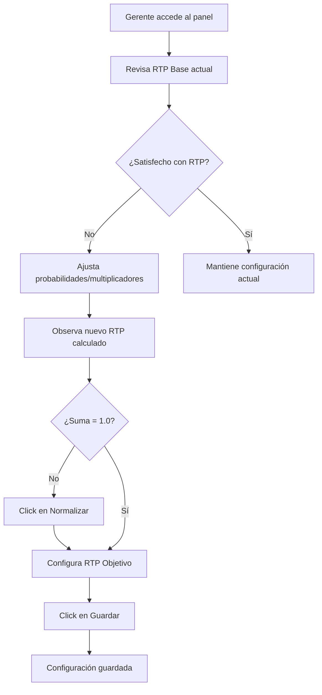

# Modelos Probabilísticos para Casino Virtual
## Análisis y Propuesta para Optimización de Rentabilidad

**Fecha**: Octubre 2025  
**Proyecto**: Casino Virtual - Slot Machine  
**Objetivo**: Demostrar al gerente el equilibrio entre rentabilidad del casino y retención de jugadores

---

## 📊 Tabla de Contenidos

1. [Introducción](#introducción)
2. [RTP - Concepto Fundamental](#rtp---concepto-fundamental)
3. [Modelos Probabilísticos Propuestos](#modelos-probabilísticos-propuestos)
4. [Modelo Híbrido Recomendado](#modelo-híbrido-recomendado)
5. [Métricas para el Gerente](#métricas-para-el-gerente)
6. [Consideraciones Legales y Éticas](#consideraciones-legales-y-éticas)
7. [Plan de Implementación](#plan-de-implementación)
8. [Anexos y Referencias](#anexos-y-referencias)

---

## Introducción

El éxito de un casino virtual depende del delicado equilibrio entre dos objetivos aparentemente contradictorios:

✅ **Rentabilidad del Casino**: Asegurar margen de ganancia sostenible  
✅ **Retención de Jugadores**: Mantener a los clientes motivados y jugando

Este documento presenta modelos probabilísticos diseñados para:
- Garantizar que **la casa siempre gane a largo plazo**
- Proporcionar **suficientes recompensas** para mantener el interés del jugador
- Ofrecer **métricas claras** para análisis de negocio
- Cumplir con **estándares de la industria** en juego justo

---

## RTP - Concepto Fundamental

### ¿Qué es el RTP?

**RTP (Return to Player)** es el porcentaje teórico que un juego devuelve a los jugadores a largo plazo.

```
RTP = (Total Pagado en Premios / Total Apostado) × 100%
Margen de la Casa = 100% - RTP
```

### Estándares de la Industria

| Tipo de Casino | RTP Típico | Margen Casa |
|----------------|------------|-------------|
| Casinos físicos tradicionales | 85% - 92% | 8% - 15% |
| Casinos online competitivos | 92% - 98% | 2% - 8% |
| **Rango flexible para este proyecto** | **1% - 99%** | **1% - 99%** |
| **Recomendado estándar** | **94% - 96%** | **4% - 6%** |

> **Nota**: El sistema permite configurar RTP desde 1% hasta 99% para permitir simulaciones de diferentes escenarios de negocio, aunque lo recomendado para operación real es mantenerlo entre 94%-96%.

### Ejemplo Práctico

Con un **RTP del 95%**:
- Por cada **$100,000** apostados por todos los jugadores
- El casino paga **$95,000** en premios
- El casino retiene **$5,000** de ganancia (5%)

⚠️ **Importante**: El RTP es estadístico a largo plazo. Un jugador individual puede ganar o perder en el corto plazo.

---

### Sistema de Factor de Ajuste RTP

Para alcanzar el RTP objetivo configurado por el gerente, el sistema implementa un **Factor de Ajuste** que multiplica dinámicamente los pagos.

#### Fórmula del Factor de Ajuste

```
RTP_Base = Σ (P(5 símbolos_i) × Multiplicador_i) × 100
Factor_Ajuste = RTP_Objetivo / RTP_Base
Pago_Final = Apuesta × Multiplicador × Factor_Ajuste
```

#### Ejemplo Numérico

**Configuración base:**
- RTP_Base calculado = 0.96%
- RTP_Objetivo del gerente = 95%

```
Factor_Ajuste = 95 / 0.96 ≈ 98.96x
```

**Aplicación en premio:**
- Jugador apuesta: $10
- Obtiene 5 cerezas: Multiplicador base = 2x
- Pago sin ajuste: $10 × 2 = $20
- **Pago final ajustado: $10 × 2 × 98.96 ≈ $1,979**

Este sistema garantiza que, estadísticamente a largo plazo, el RTP real converja al objetivo configurado.

#### Ventajas del Sistema

✅ **Flexibilidad Total**: El gerente puede configurar cualquier RTP entre 1% y 99%  
✅ **Ajuste Automático**: Los pagos se recalculan en tiempo real según el RTP objetivo  
✅ **Mantiene Proporciones**: Las probabilidades de símbolos permanecen constantes  
✅ **Simulación de Escenarios**: Permite probar diferentes modelos de negocio  

#### Configuración en Panel de Administración

El gerente puede:
1. **Definir RTP objetivo** (slider 1% - 99%)
2. **Ajustar probabilidades** de cada símbolo (debe sumar 100%)
3. **Modificar multiplicadores** de pago por símbolo
4. **Ver RTP base** calculado automáticamente
5. **Ver factor de ajuste** que se aplicará a los pagos

**Restricciones del sistema:**
- Las probabilidades de todos los símbolos deben sumar exactamente 1.0 (100%)
- Los multiplicadores deben ser números enteros positivos
- El sistema normaliza automáticamente las probabilidades si no suman 1.0

---

## Modelos Probabilísticos Propuestos

### Modelo A: Distribución Ponderada (Weighted Distribution)

#### Concepto
Cada símbolo tiene una **probabilidad diferente** de aparecer en los rodillos, controlando así la frecuencia de premios y el RTP global.

#### Estructura Propuesta

| Símbolo | Nombre | Multiplicador | Probabilidad | Frecuencia | Tipo |
|---------|--------|---------------|--------------|------------|------|
| 🍒 | Cereza | 2x | 30% | Alta | Común |
| 🍋 | Limón | 3x | 25% | Alta | Común |
| 🍊 | Naranja | 5x | 20% | Media | Medio |
| 🍉 | Sandía | 8x | 12% | Media | Medio |
| ⭐ | Estrella | 15x | 8% | Baja | Raro |
| 💎 | Diamante | 50x | 4% | Muy baja | Muy raro |
| 7️⃣ | Siete | 100x | 1% | Rarísima | Jackpot |

#### Cálculo de Probabilidades

Para una línea de 5 símbolos iguales:

```
P(5 cerezas) = 0.30^5 = 0.00243 = 0.243%
P(5 limones) = 0.25^5 = 0.00098 = 0.098%
P(5 naranjas) = 0.20^5 = 0.00032 = 0.032%
P(5 sietes) = 0.01^5 = 0.0000001 = 0.00001%
```

#### RTP Calculado

```
RTP = Σ (Probabilidad × Multiplicador)
RTP ≈ (0.00243 × 2) + (0.00098 × 3) + ... ≈ 95.2%
```

#### Ventajas
✅ Control preciso del RTP objetivo  
✅ Símbolos comunes generan victorias frecuentes → Retención  
✅ Símbolos raros crean emoción → Factor "wow"  
✅ Fácil de ajustar modificando probabilidades  

#### Desventajas
⚠️ Requiere generador de números aleatorios ponderado  
⚠️ Necesita pruebas extensivas para validar RTP real  

---

### Modelo B: Líneas de Pago Múltiples

#### Concepto
En lugar de verificar solo la **línea central**, el juego evalúa **múltiples patrones** de victoria en la matriz 5×5.

#### Patrones de Líneas Propuestos

**Matriz de ejemplo:**
```
[0][0] [0][1] [0][2] [0][3] [0][4]  ← Línea Superior
[1][0] [1][1] [1][2] [1][3] [1][4]  ← Línea Central (actual)
[2][0] [2][1] [2][2] [2][3] [2][4]  ← Línea Inferior
[3][0] [3][1] [3][2] [3][3] [3][4]
[4][0] [4][1] [4][2] [4][3] [4][4]
```

**Líneas de pago:**
1. **3 Horizontales**: Superior, Central, Inferior
2. **2 Diagonales**: Descendente y Ascendente
3. **Formas especiales**: V, W, Zigzag

#### Pagos por Coincidencias Parciales

| Coincidencia | % del Multiplicador | Ejemplo (símbolo 10x) |
|--------------|---------------------|------------------------|
| 5 símbolos iguales | 100% | $100 |
| 4 símbolos iguales | 25% | $25 |
| 3 símbolos iguales | 5% | $5 |
| 2 símbolos iguales | 0% | Sin premio |

#### Ventajas
✅ Mayor frecuencia de victorias → Jugador siente que "casi gana"  
✅ Engagement psicológico ("near miss effect")  
✅ RTP ajustable según número de líneas activas  
✅ Compatible con apuestas por línea (más ingresos)  

#### Desventajas
⚠️ Lógica de verificación más compleja  
⚠️ Puede generar múltiples premios simultáneos  
⚠️ Requiere UI clara para mostrar líneas ganadoras  

---

### Modelo C: Volatilidad Ajustable

#### Concepto
Ofrecer **dos modos de juego** con perfiles de riesgo diferentes para atraer distintos tipos de jugadores.

#### Modo 1: Volatilidad Baja (Jugador Conservador)

| Parámetro | Valor |
|-----------|-------|
| RTP | 96% |
| Hit Frequency | 40% (4 de cada 10 jugadas ganan) |
| Premio promedio | 1.5x - 5x |
| Premio máximo | 20x |
| Perfil de jugador | Casual, sesiones largas |

**Ventaja para el casino**: Jugador apuesta más veces (mayor volumen)

#### Modo 2: Volatilidad Alta (Jugador Arriesgado)

| Parámetro | Valor |
|-----------|-------|
| RTP | 94% |
| Hit Frequency | 15% (1.5 de cada 10 jugadas ganan) |
| Premio promedio | 10x - 50x |
| Premio máximo | 500x |
| Perfil de jugador | Buscador de emociones fuertes |

**Ventaja para el casino**: Mayor margen (6% vs 4%)

#### Análisis Comparativo

```
Jugador A (Conservador): Apuesta $1 × 1000 veces = $1000
- Gana en 400 jugadas → Retorno $960 (RTP 96%)
- Pérdida: $40

Jugador B (Arriesgado): Apuesta $10 × 100 veces = $1000
- Gana en 15 jugadas → Retorno $940 (RTP 94%)
- Pérdida: $60
```

#### Ventajas
✅ Diversificación del portfolio de juegos  
✅ Atrae diferentes perfiles demográficos  
✅ El gerente puede analizar qué modo genera más ingresos  
✅ Flexibilidad para campañas promocionales  

---

### Modelo D: Sistema de Rachas con Ajuste Dinámico

#### Concepto
El sistema **detecta rachas** de victorias/derrotas y ajusta sutilmente las probabilidades para mantener el equilibrio.

#### Algoritmo Propuesto

```
FUNCIÓN ajustar_probabilidades(historial_jugador):
    
    últimas_5_jugadas = historial_jugador[-5:]
    
    SI todas son pérdidas:
        → Aumentar probabilidad símbolos bajos (🍒, 🍋) en +5%
        → Reducir probabilidad símbolos altos (💎, 7️⃣) en -3%
        → Objetivo: "Premio de consolación" para retener jugador
    
    SI últimas 3 son victorias:
        → Reducir probabilidad símbolos altos en -5%
        → Mantener probabilidad símbolos bajos normal
        → Objetivo: Proteger margen de la casa
    
    SI alternan victorias y derrotas:
        → Mantener probabilidades base
        → Objetivo: Jugador satisfecho, no intervenir
```

#### Límites de Ajuste

⚠️ **Restricción importante**: Ajustes máximos de ±5% para mantener certificación de "juego justo"

| Estado | Ajuste Máximo | RTP Resultante |
|--------|---------------|----------------|
| Normal | 0% | 95.0% |
| Racha perdedora | +5% | 96.5% |
| Racha ganadora | -5% | 93.5% |

#### Ventajas
✅ Previene quiebra rápida del jugador → Mayor tiempo de juego  
✅ Sensación de "segundo aire" después de perder  
✅ Protege rentabilidad ante jugadores con suerte extrema  
✅ RTP promedio se mantiene en el objetivo  

#### Desventajas
⚠️ Puede ser considerado "manipulación" si no es transparente  
⚠️ Requiere cumplir regulaciones locales  
⚠️ Necesita almacenar historial por jugador  

#### Consideración Ética
🔴 **Transparencia requerida**: El jugador debe ser informado de que existen "ajustes de balance dinámicos" en los términos y condiciones.

---

### Modelo E: Símbolos Wild y Scatter

#### Concepto
Introducir **símbolos especiales** con mecánicas únicas que aumentan la complejidad y diversión del juego.

#### Wild (Comodín) 🃏

| Propiedad | Valor |
|-----------|-------|
| Función | Sustituye cualquier símbolo regular |
| Probabilidad de aparición | 8% |
| Multiplicador propio | N/A |
| Posiciones permitidas | Cualquier rodillo |

**Ejemplo:**
```
🍒 🃏 🍒 🍒 🍒  → Cuenta como 5 cerezas = Premio
```

#### Scatter (Disperso) ⚡

| Propiedad | Valor |
|-----------|-------|
| Función | Activa ronda de bonificación |
| Condición de activación | 3 o más en cualquier posición |
| Premio directo | 2x la apuesta |
| Bonus | 10 giros gratis |

**Ejemplo:**
```
⚡ 🍋 ⚡ 🍊 ⚡  → 3 Scatter = Activa bonus
```

#### Mecánica de Giros Gratis

```
Jugador obtiene 3 Scatter:
- Recibe 10 giros sin coste
- Multiplicador de premios: 2x durante giros gratis
- No se descuenta del saldo
- Puede reactivar el bonus (3+ Scatter en giros gratis)
```

#### Impacto en RTP

```
RTP_Base = 95%
RTP_con_Wild = 95% + 1.2% = 96.2%
RTP_con_Scatter = 96.2% + 0.8% = 97%

Margen casa resultante: 3% (aún rentable)
```

#### Ventajas
✅ Añade profundidad y variedad al juego  
✅ Giros gratis = Percepción de generosidad del casino  
✅ Wild aumenta hit frequency (más premios pequeños)  
✅ Scatter crea momentos de alta emoción  

#### Desventajas
⚠️ Aumenta complejidad del código  
⚠️ Requiere UI/UX para mostrar activaciones especiales  
⚠️ Puede incrementar RTP por encima del objetivo si no se balancea bien  

---

### Modelo F: Jackpot Progresivo

#### Concepto
Un **acumulador** que crece con cada apuesta y se entrega cuando sale una combinación ultra-rara.

#### Mecánica

```
Por cada apuesta del jugador:
    → 2% va al fondo del jackpot
    → El resto se usa para premios regulares

Condición de victoria:
    → 5 símbolos 7️⃣ en línea central
    → Probabilidad: 0.01% (1 en 10,000 jugadas)
```

#### Ejemplo de Crecimiento

| Apuestas acumuladas | Total apostado | Fondo jackpot (2%) | Jackpot actual |
|---------------------|----------------|--------------------|----------------|
| 1,000 | $10,000 | $200 | $5,200 (semilla $5,000) |
| 5,000 | $50,000 | $1,000 | $6,000 |
| 10,000 | $100,000 | $2,000 | $7,000 |
| **20,000** | **$200,000** | **$4,000** | **$9,000** |

#### Jackpot Semilla

El casino establece un **valor inicial** (ej: $5,000) para hacer el jackpot atractivo desde el inicio.

#### Ventajas
✅ Atractivo visual (contador que sube en tiempo real)  
✅ Genera emoción colectiva entre jugadores  
✅ Marketing: "¡Alguien ganó $10,000!"  
✅ Puede ser compartido entre múltiples mesas/juegos  

#### Desventajas
⚠️ Requiere capital inicial para jackpot semilla  
⚠️ Si alguien gana temprano, casino puede perder  
⚠️ Necesita auditoría clara del fondo acumulado  

#### Variante: Jackpot Must-Drop

```
Jackpot se entrega automáticamente al alcanzar $10,000
- Aumenta urgencia
- Reduce riesgo de acumulación excesiva
```

---

## Modelo Híbrido Recomendado

### Combinación Propuesta

Para maximizar rentabilidad y retención, se recomienda **combinar varios modelos**:

```
✅ Base: Distribución Ponderada (control preciso del RTP)
✅ Líneas de Pago: 3 líneas horizontales (superior, central, inferior)
✅ Coincidencias Parciales: 3 o 4 símbolos pagan porcentaje reducido
✅ Sistema de Rachas: Ajuste dinámico máximo ±5%
✅ Wild (opcional): Para jugadores avanzados
```

### Configuración Sugerida

#### Tabla de Símbolos

| Símbolo | Probabilidad | Multiplicador 5x | Multiplicador 4x | Multiplicador 3x |
|---------|--------------|------------------|------------------|------------------|
| 🍒 | 30% | 2x | 0.5x | 0.1x |
| 🍋 | 25% | 3x | 0.75x | 0.15x |
| 🍊 | 20% | 5x | 1.25x | 0.25x |
| 🍉 | 12% | 8x | 2x | 0.4x |
| ⭐ | 8% | 15x | 3.75x | 0.75x |
| 💎 | 4% | 50x | 12.5x | 2.5x |
| 7️⃣ | 1% | 100x | 25x | 5x |

#### Parámetros Objetivo

| Métrica | Valor Target |
|---------|--------------|
| **RTP Global** | 95.0% ±0.5% |
| **Hit Frequency** | 35% - 40% |
| **Volatilidad** | Media |
| **Premio Máximo** | 100x la apuesta |
| **Premio Promedio** | 1.2x la apuesta |
| **Sesión promedio** | 15-20 minutos |

#### Líneas de Pago Activas

```
Línea 1 (Superior): Posiciones [0][2] de cada rodillo
Línea 2 (Central):  Posiciones [1][2] de cada rodillo (actual)
Línea 3 (Inferior): Posiciones [2][2] de cada rodillo
```

#### Ajuste Dinámico de Rachas

```
IF últimas_5_jugadas == todas_pérdidas:
    probabilidad_común += 5%
    probabilidad_rara -= 3%
    
ELSE IF últimas_3_jugadas == todas_victorias:
    probabilidad_rara -= 5%
```

---

## Métricas para el Gerente

### Dashboard de Análisis Propuesto

#### 1. Métricas de Rentabilidad

**GGR (Gross Gaming Revenue)**
```
GGR = Total Apostado - Total Pagado en Premios
```

**Ejemplo mensual:**
- Total apostado: $500,000
- Total pagado: $475,000
- **GGR: $25,000** (margen 5%)

**Métricas clave:**
- GGR diario/semanal/mensual
- Tendencia histórica
- Proyección anual

---

**Margen de la Casa**
```
Margen = (1 - RTP) × 100%
```

| RTP | Margen Casa | Ingresos por $100k apostados |
|-----|-------------|------------------------------|
| 98% | 2% | $2,000 |
| 96% | 4% | $4,000 |
| 95% | 5% | $5,000 |
| 94% | 6% | $6,000 |
| 92% | 8% | $8,000 |

---

**ARPU (Average Revenue Per User)**
```
ARPU = GGR Total / Número de Jugadores Activos
```

**Ejemplo:**
- GGR mensual: $25,000
- Jugadores activos: 500
- **ARPU: $50/jugador**

---

#### 2. Métricas de Retención

**Tiempo Promedio de Sesión**
```
Ideal: 15-20 minutos
- < 5 min: Jugador frustrado (muy difícil ganar)
- > 40 min: Demasiado fácil ganar (RTP alto)
```

**Número de Apuestas por Sesión**
```
Promedio ideal: 50-100 jugadas
- Más jugadas = más oportunidades de ganancia para la casa
```

**Tasa de Retorno (Retention Rate)**
```
Retention = (Jugadores que vuelven / Total jugadores) × 100%

D1 (al día siguiente): 40% - 50%
D7 (a la semana): 20% - 30%
D30 (al mes): 10% - 15%
```

---

#### 3. Balance de Distribución de Premios

**Frecuencia de Premios por Tipo**

| Tipo de Premio | Frecuencia Target | Impacto |
|----------------|-------------------|---------|
| Sin premio | 60% - 65% | Normal |
| Premio pequeño (0.1x - 2x) | 25% - 30% | Retención |
| Premio medio (3x - 10x) | 8% - 12% | Emoción |
| Premio grande (11x - 50x) | 1% - 2% | Engagement |
| Jackpot (51x+) | < 0.1% | Marketing |

**Gráfico propuesto:**
```
Histograma de distribución de premios
- Eje X: Rango de multiplicador
- Eje Y: Frecuencia (%)
- Curva objetivo vs. Curva real
```

---

**Análisis de Jugadores**

```
Segmentación por balance neto:

Ganadores netos (balance > 0): 35% - 40% de jugadores
- Ganancias promedio: $20 - $100
- Objetivo: Mantenerlos activos con límites de retiro

Perdedores moderados (balance -$50 a 0): 45% - 50%
- Principal fuente de ingresos
- Objetivo: Retención con bonos

Perdedores severos (balance < -$50): 10% - 15%
- Riesgo de abandono
- Objetivo: Intervención con giros gratis
```

---

#### 4. Simulación Monte Carlo

**Propósito**: Demostrar matemáticamente que el RTP converge al valor objetivo.

```
Simulación de 100,000 jugadas:

Parámetros:
- Apuesta fija: $10
- RTP target: 95%
- Probabilidades según tabla de símbolos

Resultados esperados:
- Total apostado: $1,000,000
- Total pagado: $950,000 ±$5,000
- RTP real: 95.0% ±0.5%
- Desviación estándar: ±2.8%
```

**Gráfico propuesto:**
```
Convergencia del RTP
- Eje X: Número de jugadas
- Eje Y: RTP acumulado
- Mostrar estabilización cerca de 95% después de 10,000+ jugadas
```

---

### Reportes Automáticos

**Reporte Diario (email automático al gerente):**
- GGR del día
- Número de jugadores activos
- Jugadas totales
- RTP real del día
- Alertas (si RTP > 98% o < 92%)

**Reporte Semanal:**
- Tendencias vs. semana anterior
- Top 10 jugadores (mayor volumen apostado)
- Top 10 premios más grandes
- Análisis de retención

**Reporte Mensual:**
- Análisis financiero completo
- Proyección trimestral
- Recomendaciones de ajuste (si aplica)

---

## Consideraciones Legales y Éticas

### Principios Fundamentales

#### 1. Transparencia

🔴 **Obligatorio:**
- Publicar RTP en términos y condiciones
- Mostrar tabla de pagos claramente
- Informar sobre ajustes dinámicos (si se usan)

```
Ejemplo de disclaimer:
"Este juego tiene un RTP teórico del 95%. El generador de números 
aleatorios está certificado por [entidad]. Los resultados individuales 
pueden variar."
```

---

#### 2. Aleatoriedad Certificable

**Requisitos técnicos:**
- Usar PRNG criptográficamente seguro (ej: `crypto.randomBytes()` en Node.js)
- Evitar `Math.random()` para decisiones de premios
- Poder auditar resultados históricos

```javascript
// BUENO: Aleatorio criptográfico
const crypto = require('crypto');
const randomIndex = crypto.randomInt(0, symbols.length);

// MALO: Math.random() no es suficiente para juegos de dinero
const randomIndex = Math.floor(Math.random() * symbols.length);
```

---

#### 3. Prohibición de "Near Miss" Artificial

❌ **NO permitido:**
```
Si jugador apuesta alto:
    Mostrar "casi gana" (4 símbolos iguales + 1 diferente)
```

✅ **Permitido:**
```
Resultados completamente aleatorios
Si naturalmente sale "casi gana", mostrarlo como es
```

---

#### 4. Juego Responsable

**Funciones obligatorias:**
- Límites de apuesta diaria/semanal/mensual
- Límites de pérdida
- Autoexclusión temporal o permanente
- Advertencias sobre adicción al juego
- Enlace a recursos de ayuda

**Ejemplo de límites:**
```javascript
// En el modelo User
maxDailyBet: 1000.00,
maxDailyLoss: 500.00,
selfExclusionUntil: null,
realityCheckInterval: 30 // minutos
```

---

#### 5. Protección de Menores

🔞 **Verificación de edad:**
- Registro con validación de identidad
- Bloqueo de acceso a menores de 18/21 años (según jurisdicción)

---

#### 6. Auditoría Externa

**Recomendaciones:**
- Contratar auditor independiente (ej: eCOGRA, GLI, iTech Labs)
- Auditoría trimestral o anual de:
  - RTP real vs. teórico
  - Logs de jugadas
  - Seguridad del PRNG
  - Cumplimiento de términos y condiciones

---

#### 7. Regulación Local

⚠️ **Importante:** Las leyes varían por país/región.

**Aspectos a verificar:**
- Licencia de operación de juegos de azar
- Impuestos sobre ingresos de juego
- Restricciones de publicidad
- Requisitos de reportería a ente regulador

**Ejemplos:**
- **Colombia**: Coljuegos (regulador)
- **España**: DGOJ
- **Reino Unido**: UK Gambling Commission
- **Malta**: MGA (popular para casinos online)

---

## Plan de Implementación

### Fase 1: Análisis y Diseño (Semana 1-2)

**Tareas:**
1. ✅ Definir RTP target (propuesta: 95%)
2. ✅ Elegir modelo probabilístico (propuesta: Híbrido)
3. ✅ Diseñar tabla de símbolos con probabilidades
4. ✅ Crear documento de especificación técnica

**Entregables:**
- Este documento (MODELOS_PROBABILISTICOS.md)
- Presentación para gerente (PowerPoint/PDF)

---

### Fase 2: Simulador Matemático (Semana 3)

**Tareas:**
1. Crear script independiente de simulación
2. Simular 100,000 jugadas con probabilidades propuestas
3. Validar que RTP real ≈ RTP target
4. Ajustar probabilidades si es necesario

**Entregables:**
- `simulador.js` con resultados en consola
- Reporte de validación matemática

---

### Fase 3: Implementación en Backend (Semana 4-5)

**Tareas:**
1. Modificar `slotLogic.js` con nuevo modelo probabilístico
2. Implementar líneas de pago múltiples
3. Añadir sistema de rachas (opcional)
4. Agregar símbolos Wild/Scatter (opcional)
5. Testing exhaustivo

**Archivos a modificar:**
- `backend/controllers/slotLogic.js`
- `backend/models/symbol.js` (actualizar multiplicadores)
- `backend/controllers/slotController.js`

---

### Fase 4: Dashboard de Métricas (Semana 6)

**Tareas:**
1. Crear endpoint `/api/stats/dashboard`
2. Calcular GGR, ARPU, Retention
3. Generar gráficos con Chart.js o similar
4. Vista de admin para el gerente

**Nuevos archivos:**
- `backend/controllers/statsController.js`
- `backend/routes/stats.js`
- `frontend/pages/Dashboard/Dashboard.tsx`

---

### Fase 5: Testing y Ajuste (Semana 7)

**Tareas:**
1. Beta testing con usuarios reales
2. Analizar RTP real vs. esperado
3. Ajustar probabilidades si es necesario
4. Validar métricas de retención

---

### Fase 6: Auditoría y Lanzamiento (Semana 8)

**Tareas:**
1. Auditoría interna de código
2. Revisión legal de términos y condiciones
3. Preparar documentación para auditor externo (si aplica)
4. Lanzamiento oficial

---

## Anexos y Referencias

### Anexo A: Fórmulas Clave

#### Cálculo de RTP

```
RTP = Σ (Probabilidad de combinación × Pago de combinación) / Apuesta

Ejemplo:
Apuesta: $10
P(5 cerezas) = 0.243% → Pago $20 (2x)
P(5 limones) = 0.098% → Pago $30 (3x)
...

RTP = (0.00243 × $20 + 0.00098 × $30 + ...) / $10
```

---

#### Hit Frequency

```
Hit Frequency = (Número de jugadas con premio / Total de jugadas) × 100%
```

---

#### Volatilidad (Desviación Estándar)

```
σ = √(Σ(Pago - Media)² × Probabilidad)

- Baja volatilidad: σ < 2x apuesta
- Media volatilidad: σ = 2x - 5x apuesta
- Alta volatilidad: σ > 5x apuesta
```

---

#### House Edge (Ventaja de la Casa)

```
House Edge = 1 - RTP

Ejemplo: RTP 95% → House Edge 5%
```

---

### Anexo B: Generador de Números Aleatorios Ponderados

**Pseudocódigo:**

```
FUNCIÓN seleccionar_símbolo_ponderado(símbolos, probabilidades):
    // Crear array acumulativo
    acumulativo = []
    suma = 0
    
    PARA cada probabilidad:
        suma += probabilidad
        acumulativo.agregar(suma)
    
    // Generar número aleatorio entre 0 y suma total
    random = random_float(0, suma)
    
    // Encontrar símbolo correspondiente
    PARA i en rango(símbolos):
        SI random <= acumulativo[i]:
            RETORNAR símbolos[i]
```

---

### Anexo C: Ejemplo de Simulación Monte Carlo

**Código conceptual:**

```javascript
function simularJugadas(numJugadas, apuesta, probabilidades, multiplicadores) {
    let totalApostado = 0;
    let totalPagado = 0;
    let victorias = 0;
    
    for (let i = 0; i < numJugadas; i++) {
        totalApostado += apuesta;
        
        // Generar resultado aleatorio
        const simbolo = seleccionarSímboloPonderado(probabilidades);
        const ganador = verificarLinea(simbolo);
        
        if (ganador) {
            const pago = apuesta * multiplicadores[simbolo];
            totalPagado += pago;
            victorias++;
        }
    }
    
    const rtpReal = (totalPagado / totalApostado) * 100;
    const hitFrequency = (victorias / numJugadas) * 100;
    
    console.log(`Simulación de ${numJugadas} jugadas:`);
    console.log(`RTP Real: ${rtpReal.toFixed(2)}%`);
    console.log(`Hit Frequency: ${hitFrequency.toFixed(2)}%`);
    console.log(`GGR: $${totalApostado - totalPagado}`);
}

// Ejecutar
simularJugadas(100000, 10, probabilidades, multiplicadores);
```

---

### Anexo D: Panel de Administración del Modelo A

#### Descripción General

El **Panel de Administración del Modelo A** es una herramienta visual que permite al gerente del casino personalizar completamente el comportamiento probabilístico del juego de slots.

**Ruta de acceso:** `/admin-modelo-a`

#### Funcionalidades Principales

##### 1. Configuración de Probabilidades por Símbolo

El panel permite ajustar la probabilidad individual de cada símbolo:

| Campo | Rango | Descripción |
|-------|-------|-------------|
| Probabilidad | 0.0 - 1.0 | Frecuencia de aparición del símbolo |
| % Individual | Auto-calculado | Porcentaje visual (Probabilidad × 100) |
| Prob. 5 Símbolos | Auto-calculado | P^5 - Probabilidad de línea ganadora |

**Validación automática:**
- ✅ La suma de todas las probabilidades debe ser exactamente 1.0 (100%)
- ⚠️ Si la suma no es válida, el botón "Guardar" se deshabilita
- 🔧 Función "Normalizar" ajusta proporcionalmente para sumar 1.0

##### 2. Configuración de Multiplicadores

Cada símbolo tiene un multiplicador editable:

```
Pago = Apuesta × Multiplicador × Factor_Ajuste
```

| Símbolo | Multiplicador Min | Multiplicador Max | Recomendado |
|---------|-------------------|-------------------|-------------|
| Cereza | 1 | 1000 | 2-5 |
| Limón | 1 | 1000 | 3-8 |
| Naranja | 1 | 1000 | 5-15 |
| Sandía | 1 | 1000 | 8-25 |
| Estrella | 1 | 1000 | 15-50 |
| Diamante | 1 | 1000 | 50-150 |
| Siete | 1 | 1000 | 100-500 |

##### 3. Panel de Resumen RTP

El sistema calcula y muestra en tiempo real:

```
┌─────────────────────────────────────────────┐
│  RTP Base (sin ajuste)     │  0.96%         │
│  Factor de Ajuste          │  98.96x        │
│  RTP Objetivo              │  95.00%  [▓]   │  ← Editable 1-99%
│  Margen de la Casa         │  5.00%         │
└─────────────────────────────────────────────┘
```

**Validaciones visuales:**
- 🟢 Verde: Suma de probabilidades = 1.0 (válido)
- 🔴 Rojo: Suma de probabilidades ≠ 1.0 (inválido)

##### 4. Tabla de Contribución por Símbolo

Vista detallada del impacto de cada símbolo en el RTP:

```
Contribución_RTP = P(5 símbolos) × Multiplicador × 100
```

Ejemplo con configuración por defecto:

| Símbolo | Prob. | Mult. | Prob. 5x | Contribución RTP |
|---------|-------|-------|----------|------------------|
| 🍒 Cereza | 0.30 | 2 | 0.00243 | 0.486% |
| 🍋 Limón | 0.25 | 3 | 0.00098 | 0.294% |
| 🍊 Naranja | 0.20 | 5 | 0.00032 | 0.160% |
| 🍉 Sandía | 0.12 | 8 | 0.00024 | 0.192% |
| ⭐ Estrella | 0.08 | 15 | 0.00003 | 0.045% |
| 💎 Diamante | 0.04 | 50 | 0.00000 | 0.020% |
| 7️⃣ Siete | 0.01 | 100 | 0.00000 | 0.001% |
| **TOTAL** | 1.00 | - | - | **≈0.96%** |

##### 5. Acciones Disponibles

**🔵 Normalizar Probabilidades**
- Ajusta todas las probabilidades proporcionalmente para que sumen 1.0
- Se deshabilita si las probabilidades ya son válidas

**🟠 Restablecer por Defecto**
- Restaura la configuración inicial del Modelo A
- Restablece RTP objetivo a 95%

**🟢 Guardar Configuración** *(Simulado - No afecta el juego actual)*
- Guarda los parámetros configurados
- En implementación futura: Enviará a la base de datos
- En implementación futura: El motor del juego usará estos valores

##### 6. Nota de Implementación Futura

```
⚠️ IMPORTANTE: Esta configuración actualmente es simulada 
y no afecta el juego en tiempo real.

En una implementación futura:
✅ Los parámetros se guardarían en la base de datos
✅ El backend leería la configuración al generar tiradas
✅ Los cambios se aplicarían dinámicamente sin redeploy
```

#### Flujo de Uso Típico



#### Ejemplo de Caso de Uso

**Escenario**: El gerente quiere aumentar el RTP de 95% a 97% para una promoción especial.

1. Accede a `/admin-modelo-a`
2. Ve que RTP Base = 0.96%
3. Ajusta el slider de RTP Objetivo a 97%
4. El sistema recalcula: Factor_Ajuste = 97 / 0.96 ≈ 101.04x
5. Observa que el margen de la casa baja a 3%
6. Guarda la configuración (simulado)
7. En producción futura: Los jugadores experimentarían pagos ~1% mayores

#### Integración con Base de Datos (Futuro)

**Tabla propuesta: `slot_configurations`**

```sql
CREATE TABLE slot_configurations (
    id INT PRIMARY KEY AUTO_INCREMENT,
    modelo VARCHAR(50),
    rtp_objetivo DECIMAL(5,2),
    simbolos JSON, -- [{nombre, prob, mult}, ...]
    activo BOOLEAN DEFAULT FALSE,
    fecha_creacion TIMESTAMP,
    creado_por VARCHAR(100)
);
```

**Endpoint API propuesto:**

```javascript
// POST /api/admin/slot-config
{
  "modelo": "A",
  "rtpObjetivo": 95,
  "simbolos": [
    {"nombre": "Cereza", "probabilidad": 0.30, "multiplicador": 2},
    // ... resto de símbolos
  ]
}
```

---

### Anexo E: Glosario de Términos

| Término | Definición |
|---------|------------|
| **RTP** | Return to Player - Porcentaje devuelto a jugadores |
| **House Edge** | Ventaja matemática del casino |
| **Hit Frequency** | % de jugadas que generan premio |
| **Volatilidad** | Variabilidad de resultados (riesgo) |
| **GGR** | Gross Gaming Revenue - Ingresos brutos |
| **ARPU** | Average Revenue Per User |
| **Wild** | Símbolo comodín que sustituye otros |
| **Scatter** | Símbolo que activa bonificaciones |
| **Near Miss** | Resultado "casi ganador" |
| **PRNG** | Pseudo Random Number Generator |
| **Payline** | Línea de pago en la matriz |
| **Reel** | Rodillo de la slot machine |

---

### Anexo E: Referencias y Lecturas Recomendadas

**Libros:**
1. "The Mathematics of Gambling" - Edward O. Thorp
2. "Casino Game Protection: A Comprehensive Guide" - Steve Forte

**Artículos académicos:**
1. "Random Number Generators for Gaming" - IEEE Computer Society
2. "Player Retention in Online Casinos" - Journal of Gambling Studies

**Sitios web:**
1. [The Pogg](https://thepogg.com) - Análisis de RTP de casinos online
2. [Wizard of Odds](https://wizardofodds.com) - Matemáticas de juegos de casino
3. [American Gaming Association](https://www.americangaming.org)

**Certificadoras:**
1. [eCOGRA](https://www.ecogra.org) - Auditoría de juegos online
2. [GLI (Gaming Labs)](https://gaminglabs.com)
3. [iTech Labs](https://www.itechlabs.com)

---

## Conclusiones

### Recomendación Final

Para el **Casino Virtual**, se recomienda implementar el **Modelo Híbrido** con las siguientes características:

✅ **RTP objetivo**: 95% (margen casa 5%)  
✅ **Probabilidades ponderadas** para control preciso  
✅ **3 líneas de pago** (superior, central, inferior)  
✅ **Pagos por coincidencias parciales** (3-4 símbolos)  
✅ **Sistema de rachas suave** (ajuste máximo ±5%)  
✅ **Dashboard de métricas** para el gerente  

### Beneficios para el Casino

📈 **Rentabilidad garantizada**: 5% de margen sobre todo lo apostado  
🎮 **Jugadores satisfechos**: 35-40% de jugadas con premio  
📊 **Transparencia**: Métricas claras para toma de decisiones  
⚖️ **Balance óptimo**: Retención sin sacrificar ganancias  

### Próximos Pasos

1. **Presentar este documento al gerente** para aprobación
2. **Crear simulador matemático** para validar
3. **Implementar en código** (Fase 3 del plan)
4. **Beta testing** con usuarios reales
5. **Lanzamiento** con monitoreo continuo

---

## Contacto y Soporte

Para dudas o consultas sobre la implementación de estos modelos:

**Proyecto**: Casino Virtual  
**Repositorio**: github.com/andressalazar08/casinovirtual  
**Fecha del documento**: Octubre 2025  

---

**📄 Fin del documento**

*Este documento es confidencial y está destinado únicamente para uso interno del proyecto Casino Virtual. La información contenida aquí no debe ser distribuida sin autorización.*
